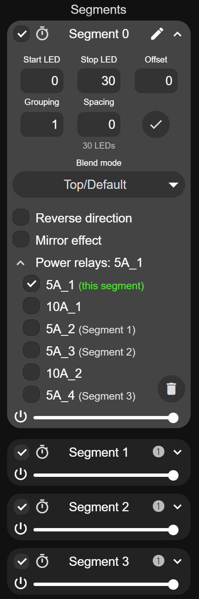

# Power Manager (WLED usermod)

Advanced power switching usermod for [WLED](https://github.com/wled/WLED): named relay/MOSFET
outputs (direct GPIO or PCF8574 / AW9523(B) I2C expanders) coupled to segments, so turning a
segment off cuts that section's actual supply power - with anti-flash power sequencing, PSU
stabilization, a dedicated Master AC relay and optional main-power sync.

Requires a recent WLED base (v0.16 / 17.0-dev nightlies) with the external-usermod build system.

## Installation

**As an external usermod (recommended):** add the repository to `custom_usermods` in your
`platformio_override.ini` environment - WLED's build system fetches and links it automatically:

```ini
[env:my_build]
extends = env:esp32dev
custom_usermods = https://github.com/intermittech/wled-usermod-powermanager.git
```

(Pin a release with `#v1.0.0` at the end of the URL. See `examples/platformio_override.ini`
for complete environments including all compile-time options.)

**Or as a local copy:** copy this repository into your WLED tree as
`usermods/PowerManager/` and use `custom_usermods = PowerManager`.

### Optional web UI integration (segment cards)



The "Power relays" menu on the segment cards (shown on the right): link power relays right
where you control the segment, with the current assignment of every relay at a glance -
green for this segment, dimmed for relays serving another one.

This part requires a small patch to one WLED core file (`wled00/data/index.js`), applied
**before building the firmware**. It cannot live inside the usermod because that file is
compiled into WLED's web UI at build time. It is entirely optional: without it everything
works and links are configured on the Usermods settings page instead.

See [`ui-patch/`](ui-patch/) for the automatic patcher (anchor-based, idempotent, with
backup) and the manual patch documentation. Firmware built from a patched tree **without**
this usermod behaves exactly like stock WLED.

<br clear="right"/>

---

Power Manager switches the actual supply power of your LED installation: multiple relay/MOSFET
outputs (direct GPIO or via PCF8574 / AW9523(B) I2C port expanders) that can be named, coupled to
segments (cut a section's power when its segment is off), and orchestrated with anti-flash power
sequencing, PSU stabilization and a dedicated Master AC relay.
(**NOTE:** Expander use requires global I2C pins to be defined in LED & Hardware settings.)

## Heritage

This usermod grew out of WLED's built-in `multi_relay` usermod, written and maintained by
**@blazoncek** (with contributions credited in the change log below, which preserves that
lineage). Power Manager is maintained separately and is **not** meant to be installed alongside
`multi_relay` - it uses its own configuration (`PowerManager`) and JSON API key, and
**automatically migrates settings** saved by a previous `multi_relay` installation on first boot.
The MQTT topics (`.../relay/N`) and the HTTP `/relays` API are kept unchanged so existing
automations and Home Assistant entities keep working.

## I2C port expanders

Select the expander type in the usermod settings (or at compile time, see below). Relays are attached to expander ports using virtual pin numbers starting at 100:

| Expander | Ports | Virtual pins | I2C addresses |
|----------|-------|--------------|---------------|
| PCF8574  | 8 (P0-P7) | 100-107 | 0x20-0x27 (PCF8574A: 0x38-0x3F) |
| AW9523   | 16 (P0_0-P0_7, P1_0-P1_7) | 100-107 (P0_x), 108-115 (P1_x) | 0x58-0x5B (AD1/AD0 straps) |

After changing the expander type, save and re-open the Usermods settings page so the pin dropdowns show the matching port names. With no expander selected (None), no expander ports are offered in the pin dropdowns.

### AW9523 notes

* The chip is verified via its ID register at boot; the Info page shows whether it was found.
* Only the ports assigned to relays are (re)configured (GPIO mode, output direction, interrupts masked) - other ports of the chip are left untouched, so they remain available for other purposes.
* The P0_x port is open-drain by default in hardware. The usermod configures it as push-pull by default (recommended when driving relay/optocoupler inputs directly). Untick `AW9523-pushpull` (or set `-D AW9523_P0_PUSHPULL=false`) if your board relies on open-drain outputs with external pull-ups. P1_x is always push-pull.
* The RSTN pin of the AW9523 has an internal 100k pull-*down* - it must be tied high (to VCC) on the board or the chip stays in reset.

## Segment coupling

A relay can be coupled to a WLED segment so it follows that segment's on/off state - useful for cutting the actual supply power of an LED section when its segment is turned off in the UI. Per relay, the `segment` value is:

* `-1` - not coupled (default; relay behaves as before)
* `0`-`31` - relay follows that segment: on when the segment is on (and global power is on), off otherwise

**Master AC relay:** relay 0 doubles as a dedicated master slot, meant for the AC-side trigger of the main power supply (the other relays typically switch DC MOSFET outputs). Enable it with the *Enabled* checkbox in its section on the settings page (or `-D POWERMANAGER_MASTER=true` for pre-built images) and pick its pin; while enabled it is on whenever *any* segment is on, and internally uses the reserved segment value 99 (only relay 0 may hold it). A master relay never switches off while any section relay is still on - the PSU is always the last to cut, and its `delay-off-s` counts from the moment the last section switched off. It defaults to a 5 second off-delay (PSU anti-cycling: quick re-ons never drop the supply); set your own value to override.

The optional *Sync main power* setting (`main-sync`, `-D POWERMANAGER_MASTER_MAIN_SYNC=true`) mirrors the master on WLED's main power state: when the master cuts because every segment was switched off, main power is switched off as well (UI, MQTT and Home Assistant all show off) - and switching any segment back on restores main power and powers everything up through the normal sequence. Turning main power off yourself behaves as usual: segments stay dark until you turn it back on.

The global `stabilize-s` setting adds a PSU stabilization window to the master relay: after it powers on, the strip is held black and all segment-coupled relays postpone energising their sections for that many seconds, giving the supply time to come up and stabilize before load is applied. Once the window clears, sections power up with the normal anti-flash sequence and fade in. When the master had to power up first, a section's `delay-on-s` starts counting only after the stabilization window has passed (2s stabilize + 2s delay-on = 4s total); if the master was already on, only `delay-on-s` applies.

Behavior:

* Switching **on** honours the relay's `delay-on-s`, then runs the anti-flash sequence (see below). Switching **off** first lets the segment's fade-out (transition) finish, and additionally honours the relay's `delay-off-s` setting - the relay switches at whichever ends later (both measured from the moment the segment is turned off). Toggling the segment back before the pending switch fires cancels it.
* **Anti-flash power-on:** to prevent LEDs from flashing while their supply ramps up, the segment is forced to black `black-pre-ms` (default 200) before the port is energised and kept black for `black-post-ms` (default 200) after. The fade-up transition is then (re)started, so the full fade is visible once power is ready - even when `delay-on-s` postponed the power-on past the original fade. Set both to 0 to disable and switch instantly.
* **Minimum off-time:** after a port is cut it will not be re-energised for `min-off-ms` (default 2000). Re-powering a half-discharged strip can make the LED chips latch a white flash regardless of the (black) data being sent; this gate lets the strip's capacitors discharge first. Set to 0 to disable.
* Global (main) power off turns all coupled relays off (after the LED fade completes); global power on restores each relay according to its segment's state.
* A coupled relay is *exclusively* segment-driven: `external` is forced off and MQTT/HTTP/JSON on-off commands and buttons are ignored for it. Its state is still published via MQTT.
* Multiple relays may follow the same segment (one section fed by several supplies).

**Caveats:**

* Deleting a linked segment switches its relay(s) off and removes the link automatically, so a segment created later (which reuses the freed id) does not inherit stale relay links. Note this also applies when WLED itself rebuilds segments (e.g. after changing LED outputs, or segment resets on critically low memory) - re-link afterwards.
* Segments are referenced by their index. In the rare cases where WLED compacts the segment list (batch deletion of most segments, low-memory purge), remaining segment ids shift and links should be checked.

Coupling can be set via the Usermods settings page, or via JSON: `{"PowerManager":{"relay":1,"seg":2}}` (`"seg":-1` decouples; the master role is settings-only and cannot be assigned via the API). Changes are persisted automatically unless `"save":false` is added, which applies the link in RAM only.

**Recommended setup:** enable *"Make a segment for each output"* (LED settings, or `-D WLED_AUTOSEGMENTS`). Segments then map 1:1 to the physical outputs and never move, so links are configured once and simply keep working - presets need no special handling.

### Per-preset relay links (advanced)

Relay links are static configuration by default - they describe wiring, and ordinary (color/effect) presets do not touch them. Most users never need this section. Only if your presets re-shape the segment *layout*, a preset can carry its own links, applied together with the preset. Save the preset with an API command instead of "Use current state" (or edit it once in the preset dialog) and include a `PowerManager` block next to the state, e.g.:

```json
{"on":true,"seg":[{"id":0,"start":0,"stop":60,"on":true},{"id":1,"start":60,"stop":120,"on":true}],
 "PowerManager":[{"relay":1,"seg":0,"save":false},{"relay":2,"seg":1,"save":false}]}
```

Use `"save":false` inside presets so switching them does not write to flash; the links configured in settings remain the boot baseline (have the boot preset carry its own links, and note that any later settings save captures whatever links are active at that moment). In a preset with fewer segments, explicitly set the unused relays to `"seg":-1` - this beats the automatic unlink to it and avoids a config write per layout switch. Presets without a `PowerManager` block never change links, and presets containing one are simply ignored on builds without this usermod.

With the accompanying web-UI patch, each segment shows a collapsible "Power relays" menu listing all relays by *name* (see below) for linking one or more relays to that segment. The menu is hidden when the usermod is not installed.

## Relay names

Each relay can be given a name (up to 32 characters, e.g. the physical output port it powers: "LED Out 3", "Kitchen cabinet"). Names are shown in the segment "Power relays" menu, on the Info page, and are used as the Home Assistant entity name for external relays. Set names on the Usermods settings page, or at compile time via `POWERMANAGER_NAMES` (see below).

## HTTP API
All responses are returned in JSON format. 

* Status Request: `http://[device-ip]/relays`
* Switch Command: `http://[device-ip]/relays?switch=1,0,1,1`

The number of values behind the switch parameter must correspond to the number of relays. The value 1 switches the relay on, 0 switches it off. 

* Toggle Command: `http://[device-ip]/relays?toggle=1,0,1,1`

The number of values behind the parameter switch must correspond to the number of relays. The value 1 causes the relay to toggle, 0 leaves its state unchanged.

Examples:
1. total of 4 relays, relay 2 will be toggled: `http://[device-ip]/relays?toggle=0,1,0,0`
2. total of 3 relays, relay 1&3 will be switched on: `http://[device-ip]/relays?switch=1,0,1`

## JSON API
You can toggle the relay state by sending the following JSON object to: `http://[device-ip]/json`

Switch relay 0 on: `{"PowerManager":{"relay":0,"on":true}}`

Switch relay 3 and 4 off: `{"PowerManager":[{"relay":2,"on":false},{"relay":3,"on":false}]}`


## MQTT API

* `wled`/_deviceMAC_/`relay`/`0`/`command` `on`|`off`|`toggle`
* `wled`/_deviceMAC_/`relay`/`1`/`command` `on`|`off`|`toggle`

When a relay is switched, a message is published:

* `wled`/_deviceMAC_/`relay`/`0` `on`|`off`


## Usermod installation

Add `PowerManager` to the `custom_usermods` of your platformio.ini environment.

You can override the default maximum number of relays (which is 4) by defining POWERMANAGER_MAX_RELAYS (up to 16).

Some settings can be defined (defaults) at compile time by setting the following defines:

```cpp
// enable or disable HA discovery for externally controlled relays
#define POWERMANAGER_HA_DISCOVERY true

// select an I2C port expander (define at most one of these)
#define USERMOD_USE_PCF8574
#define USERMOD_USE_AW9523

// expander I2C address (defaults: PCF8574 0x20, AW9523 0x58)
#define PCF8574_ADDRESS 0x20
#define AW9523_ADDRESS 0x58

// AW9523 P0_x drive mode: true = push-pull (default), false = open-drain
#define AW9523_P0_PUSHPULL true

// anti-flash blackout around segment power-on (ms)
#define POWERMANAGER_BLACK_PRE_MS 200
#define POWERMANAGER_BLACK_POST_MS 200

// PSU stabilization seconds, applied to any-segment (99) master relays
#define POWERMANAGER_STABILIZE 0

// minimum port off-time in ms before re-energising (LED capacitor discharge)
#define POWERMANAGER_MIN_OFF_MS 2000
```

The following definitions should be a list of values (maximum number of entries is POWERMANAGER_MAX_RELAYS) that will be applied to the relays in order:
(e.g. assuming POWERMANAGER_MAX_RELAYS=2)

```cpp
#define POWERMANAGER_PINS 12,18
#define POWERMANAGER_DELAYS 0,0      // seeds both delay-on-s and delay-off-s
#define POWERMANAGER_EXTERNALS false,true
#define POWERMANAGER_INVERTS false,false
#define POWERMANAGER_SEGMENTS 0,-1   // couple relay 0 to segment 0 (-1 = not coupled)
#define POWERMANAGER_MASTER true     // relay 0 = dedicated Master AC relay (PSU trigger)
#define POWERMANAGER_MASTER_MAIN_SYNC true  // main power mirrors the Master AC relay
#define POWERMANAGER_TAKEOVER true   // unconfigured relays stay off instead of following main power
#define POWERMANAGER_NAMES "Port 1","Port 2"   // relay names (quoted strings)
```

In `platformio_override.ini` the name strings need escaped quotes:

```ini
  -D POWERMANAGER_NAMES='"Port 1","Port 2"'
```
These can be set via your `platformio_override.ini` file or as `#define` in your `my_config.h` (remember to set `WLED_USE_MY_CONFIG` in your `platformio_override.ini`)

Expander virtual pins (100+) can be used in `POWERMANAGER_PINS`, allowing fully pre-configured firmware images. Example `platformio_override.ini` environment for a board with 8 relays on an AW9523:

```ini
[env:esp32dev_powermanager_aw9523]
extends = env:esp32dev
custom_usermods = PowerManager
build_flags = ${env:esp32dev.build_flags}
  -D USERMOD_USE_AW9523
  -D AW9523_ADDRESS=0x58
  -D POWERMANAGER_MAX_RELAYS=8
  -D POWERMANAGER_PINS=100,101,102,103,104,105,106,107  ;; P0_0..P0_7
  -D POWERMANAGER_EXTERNALS=true,true,true,true,true,true,true,true
```

## Configuration

Usermod can be configured via the Usermods settings page.

* `enabled` - enable/disable usermod
* `expander` - I2C port expander type (None / PCF8574 / AW9523)
* `expander-address` - I2C address of the expander (WARNING: enter *decimal* value; PCF8574: 32-39 or 56-63, AW9523: 88-91)
* `AW9523-pushpull` - drive the AW9523 P0_x port in push-pull mode (untick for open-drain)
* `broadcast`- time in seconds between MQTT relay-state broadcasts
* `HA-discovery`- enable Home Assistant auto discovery
* `take-over-relays` - off by default (stock behavior): when enabled, unconfigured relays (pin set, but no segment link and not externally controlled) stay off until they are given a role, instead of following main power - avoids surprises once part of the relays is segment-coupled
* `black-pre-ms` / `black-post-ms` - anti-flash: black frames sent to a coupled segment before/after its power port switches on (both 0 = disabled); see *Segment coupling*
* `stabilize-s` - PSU stabilization time in seconds: the other relays wait this long after the Master AC relay powers on (default 1, max 60); each relay's own `delay-on-s` is added on top, allowing a staggered power-on; see *Segment coupling*
* `min-off-ms` - minimum time a port stays off before it may be re-energised (LED capacitor discharge, prevents white flash on rapid toggling; max 10000); see *Segment coupling*
* `pin` - ESP GPIO pin the relay is connected to, or expander virtual pin 100+ (can be configured at compile time `-D POWERMANAGER_PINS=xx,xx,...`)
* `delay-on-s` / `delay-off-s` - delay in seconds before the relay switches on / off (individually per relay; a legacy `delay-s` value migrates to both)
* `active-high` - shown as *Active Low* on the settings page: when ticked, relay On drives the output low (for active-low relay boards); unticked (default) On drives it high. The config key stores the invert flag and keeps its historical name for compatibility.
* `external` - shown as *External control*: if enabled, WLED does not control the relay, it can only be triggered by an external command (MQTT, HTTP, JSON or button); not available for segment-coupled relays (the checkbox is disabled once a segment is set)
* `button` - button (from LED Settings) that controls this relay
* `segment` - couple this relay to a segment (-1 = off, 0-31 = follow that segment); see *Segment coupling*
* `master` - relay 0 only: use it as the dedicated Master AC relay (on while any segment is on); see *Segment coupling*
* `main-sync` - relay 0 only: main power mirrors the Master AC relay (off when it cuts, back on with a segment); see *Segment coupling*
* `name` - user-friendly relay name (max 32 chars), shown in the segment "Power relays" menu, Info page and Home Assistant; see *Relay names*

If there is no PowerManager section, just save current configuration and re-open Usermods settings page. 

Have fun - @blazoncek

## Change log
2021-04
* First implementation.

2021-11
* Added information about dynamic configuration options
* Added button support.

2023-05
* Added support for PCF8574 I2C port expander (multiple)

2023-11
* @chrisburrows Added support for compile time defaults for setting DELAY, EXTERNAL, INVERTS and HA discovery

2026-07 - Changed to PowerManager
* Added support for the AW9523(B) 16-port I2C expander (expander type selector replaces the PCF8574 checkbox; legacy configs migrate automatically)
* Maximum number of relays raised from 8 to 16
* Added segment coupling: a relay can follow a segment's on/off state (incl. "any segment" master mode) to cut power to individual LED sections
* Added relay names (settings page or `POWERMANAGER_NAMES`), used in the segment "Power relays" menu, Info page and HA discovery
* Split `delay-s` into per-relay `delay-on-s` and `delay-off-s` (legacy configs migrate to both)
* Added anti-flash power-on: black frames around energising a coupled port (`black-pre-ms`/`black-post-ms`)
* Added `stabilize-s` PSU stabilization for any-segment master relays: sections wait after the main supply powers on
* Relay 0 is now the dedicated Master AC relay slot (enable checkbox on the settings page; the any-segment role is reserved for it)
* Added optional main power sync: main power follows the Master AC relay (off when everything is off, restored by switching a segment on)
* Presets can carry relay links (`PowerManager` block with optional `"save":false` for RAM-only application)
* Renamed from Multi Relay to **Power Manager** and split off as a standalone external usermod; configuration from a previous multi_relay installation migrates automatically (original multi_relay by @blazoncek remains part of WLED)